# Project – Manage Subscriptions and RBAC in Microsoft Azure (AZ-104 Lab)

---

## Overview

This project documents my walkthrough of the **Manage Subscriptions and RBAC** lab, based on Gbenga Adekunle's lab guide. It covers organizing Azure resources under a management group, assigning built-in RBAC roles to a security group at scale, and building a **custom role** by cloning a built-in role and explicitly excluding a permission from it — all performed hands-on in my own Azure tenant and documented with evidence, including the activity log confirming every change.

---

## Environment

| Tool | Purpose |
|------|---------|
| Microsoft Entra ID | Identity platform (cloud directory) |
| Azure Resource Manager | Management group and subscription hierarchy |
| Azure Portal | GUI administration |
| Default Directory (personal Entra ID tenant) | Lab environment |
| GitHub | Documentation and version control |

---

## Lab Tasks

---

### 🗂️ Task 1 — Creating a Management Group

**Scenario:** Before assigning access at scale, resources and subscriptions needed a governance boundary to attach role assignments and policies to above the subscription level.

**Actions Taken:**
1. Navigated to **Resource Manager → Management groups**
2. Created a new management group: **MG-1**
3. Confirmed MG-1 appears under the Tenant Root Group alongside the existing subscription

**Principle Applied:** Governance hierarchy — management groups let RBAC and policy be assigned once at a level that automatically inherits down to every subscription and resource beneath it, instead of repeating assignments per subscription.

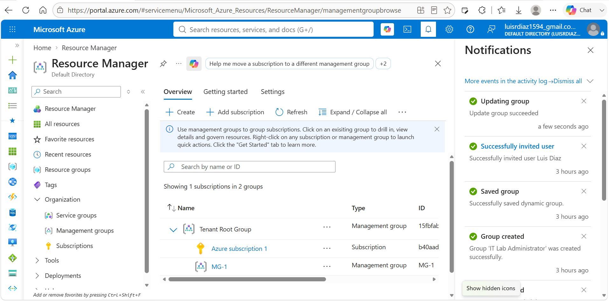
*MG-1 management group created and visible in Resource Manager*

---

### 🟦 Task 2 — Group-Based RBAC Assignment (Help Desk → Virtual Machine Contributor)

**Scenario:** Rather than granting VM management permissions to individual users, I created a security group and assigned the built-in **Virtual Machine Contributor** role to the group itself at the management group scope — so any current or future member inherits the access automatically.

**Actions Taken:**
1. Created a new security group: **Help Desk**
2. Added two members to the group: **Brian Rodgers** and **John Byers**
3. Confirmed the Help Desk group was created successfully with both members
4. Navigated to **MG-1 → Access control (IAM) → Add role assignment**
5. Searched for and selected the built-in **Virtual Machine Contributor** role
6. Assigned the role to the **Help Desk** group
7. Confirmed Help Desk now appears as a group member under Virtual Machine Contributor at the MG-1 scope

**Principle Applied:** Group-based RBAC — granting a role to a group instead of individual users means access scales automatically as members join or leave the group, without re-touching the role assignment itself.

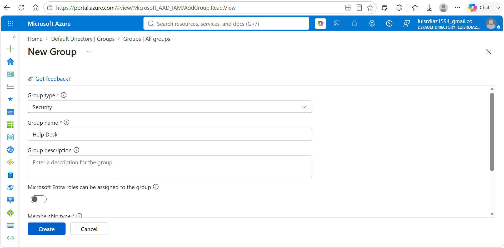
*Creating the Help Desk security group*

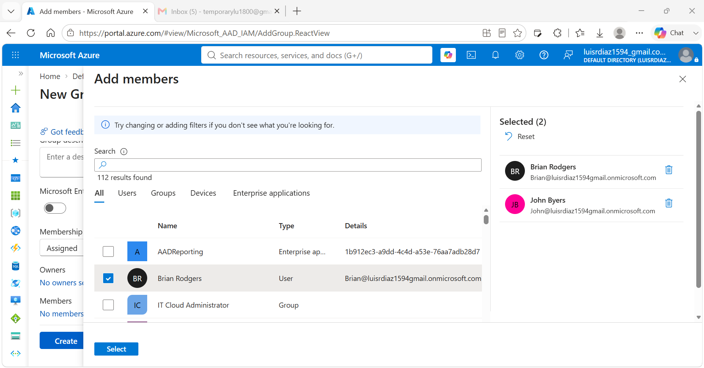
*Adding Brian Rodgers and John Byers as members*

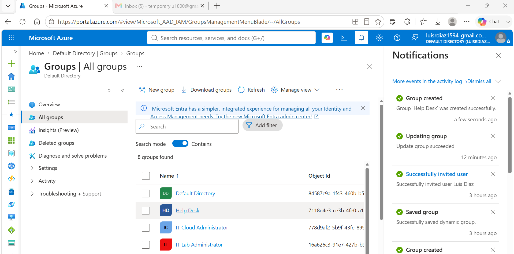
*Help Desk group created successfully with two members*

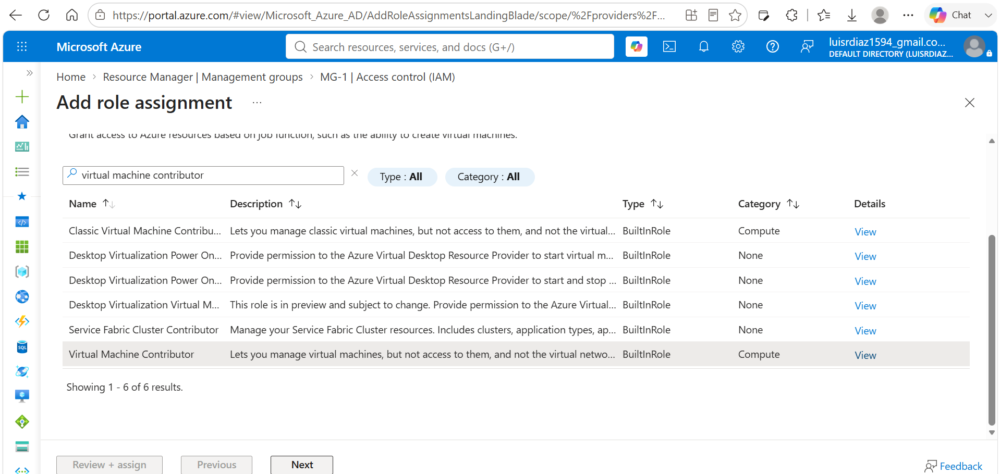
*Searching for the built-in Virtual Machine Contributor role at the MG-1 scope*

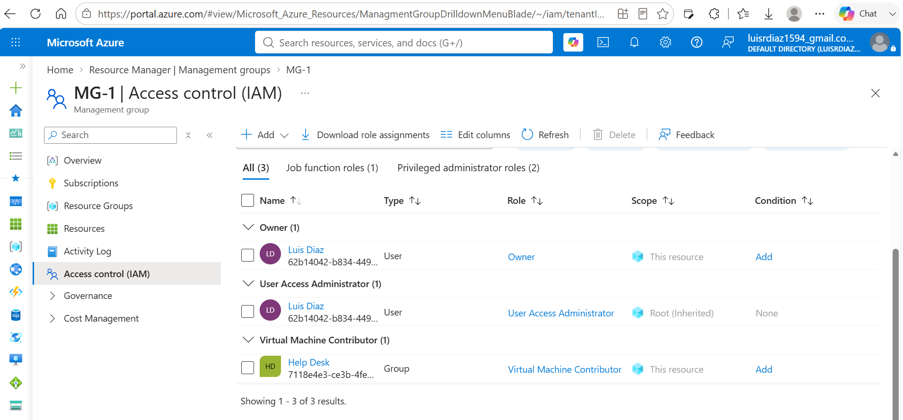
*Help Desk group shown as a member under the Virtual Machine Contributor role assignment*

---

### 🛠️ Task 3 — Building a Custom Role (Custom Support Request)

**Scenario:** The built-in Support Request Contributor role included one permission I didn't want to grant — registering the support resource provider. Rather than accept the built-in role as-is, I cloned it into a custom role and explicitly excluded that single permission.

**Actions Taken:**
1. Navigated to **MG-1 → Access control (IAM) → Add custom role**
2. Named the role **Custom Support Request** and set the baseline permissions to **Clone a role: Support Request Contributor**
3. Reviewed the cloned permissions: `Microsoft.Authorization/*/read`, `Microsoft.Resources/subscriptions/resourceGroups/read`, and `Microsoft.Support/*`
4. Selected **Exclude permissions** and searched for **Microsoft Support**
5. Selected the specific permission **Other: Registers Support Resource Provider** and added it as an exclusion
6. Confirmed the permissions list now included `Microsoft.Support/register/action` as a **NotAction**
7. Reviewed the generated **JSON role definition** confirming the action/notAction split
8. Confirmed **Custom Support Request** now appears listed as a `CustomRole` under MG-1's roles

**Principle Applied:** Least privilege via custom roles — cloning a built-in role and subtracting a single unwanted permission is safer and more precise than either accepting a built-in role wholesale or building a role from scratch.

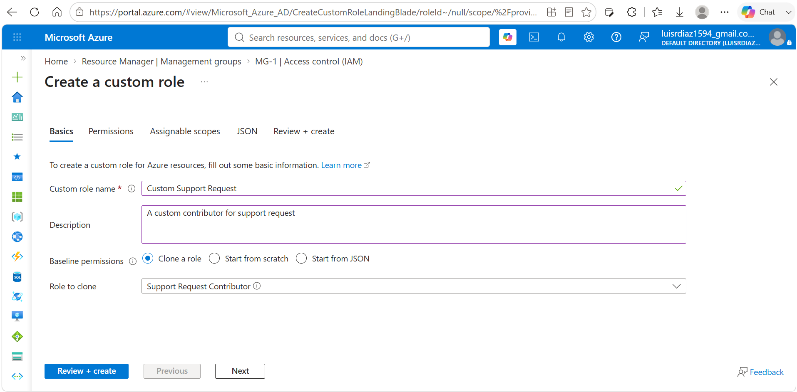
*Creating a custom role cloned from Support Request Contributor*

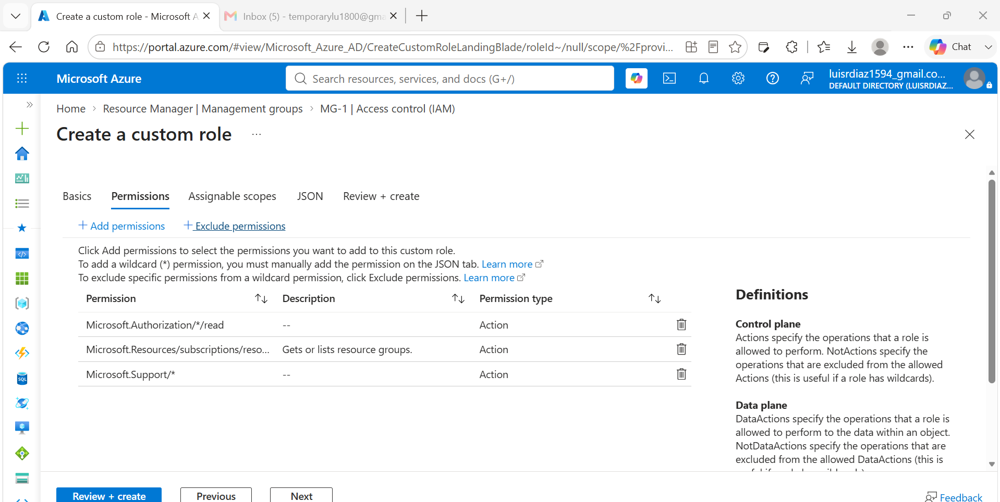
*Cloned permissions before any exclusions are applied*

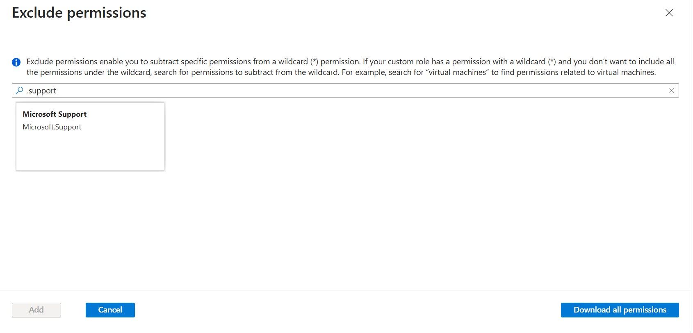
*Searching for Microsoft Support permissions to exclude*

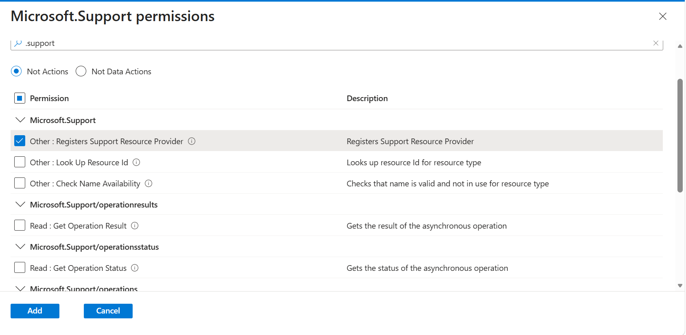
*Selecting the specific "Registers Support Resource Provider" permission to exclude*

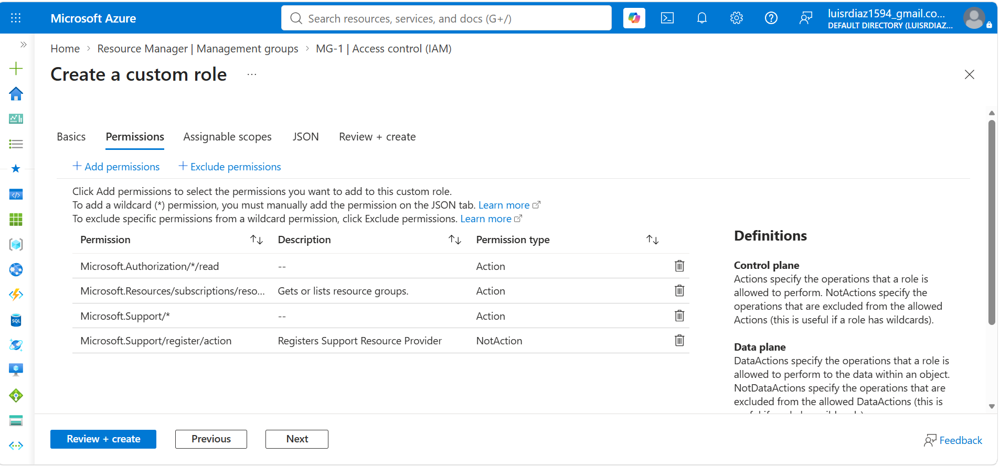
*Permissions list now shows the excluded permission as a NotAction*

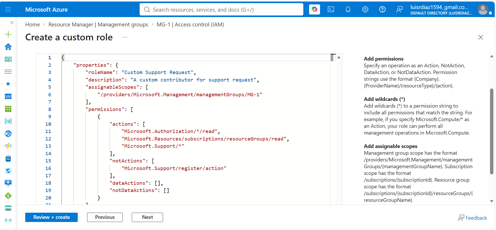
*Generated JSON role definition showing allowed actions vs. the excluded NotAction*

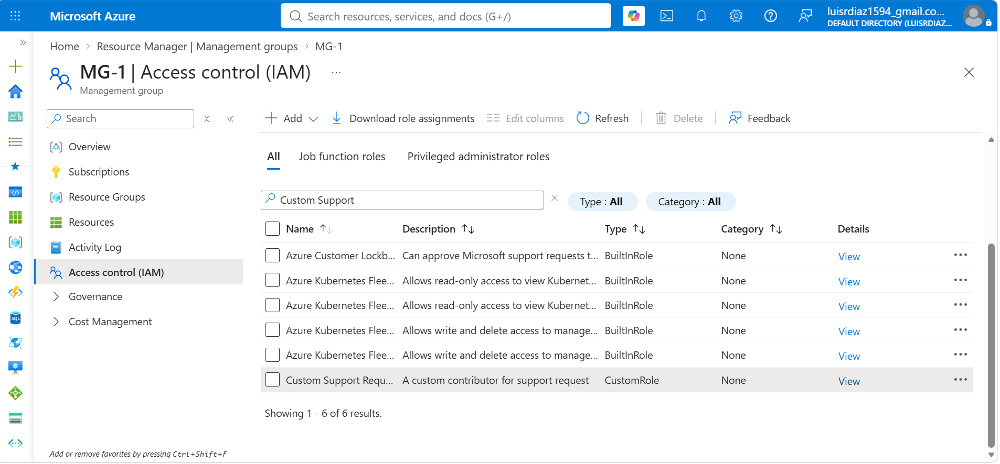
*Custom Support Request role now listed as a CustomRole under MG-1*

---

### 📋 Task 4 — Verifying Changes via Activity Log

**Scenario:** To confirm every administrative action was tracked and auditable, I reviewed the management group's activity log after completing the role and assignment work.

**Actions Taken:**
1. Navigated to **MG-1 → Activity Log**
2. Confirmed all recent operations were logged, including **Create or update custom role**, **Create role assignment**, and **Create or Update**, each with a Succeeded status and timestamp

**Principle Applied:** Audit readiness — every RBAC and governance change made through the portal is automatically captured in the activity log, giving a verifiable trail of who changed what and when.

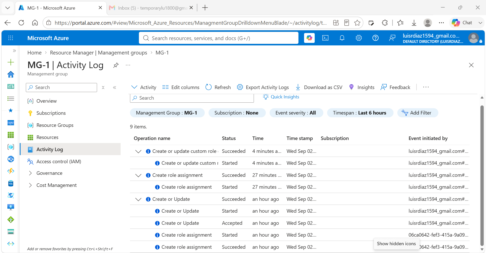
*Activity log confirming all role and assignment changes succeeded*

---

## Skills Demonstrated

| Skill | How It Was Applied |
|-------|--------------------|
| Management Group Governance | Created MG-1 as a governance boundary above the subscription level |
| Group-Based RBAC | Assigned a built-in role to a security group rather than individual users |
| Built-In Role Assignment | Assigned Virtual Machine Contributor at the management group scope |
| Custom Role Design | Cloned a built-in role and excluded a specific unwanted permission |
| Least Privilege | Removed the "Registers Support Resource Provider" permission via a NotAction |
| JSON Role Definitions | Reviewed the generated role JSON to confirm actions vs. notActions |
| Audit Readiness | Verified every change was logged in the management group's Activity Log |
| Documentation | Structured, evidence-based write-up with a screenshot for every step |

---

## Lessons Learned

**Management groups make scale possible.** Assigning Virtual Machine Contributor once at the MG-1 level, rather than per-subscription, means any current or future subscription placed under that management group inherits the same access automatically.

**Cloning beats building from scratch when the goal is a small change.** Starting the custom role from the Support Request Contributor baseline and subtracting one permission was far faster and less error-prone than assembling permissions from zero, while still landing on a precisely scoped role.

**Excluding a permission is different from denying access to a resource.** The `NotAction` on `Microsoft.Support/register/action` subtracts that specific operation from the wildcard `Microsoft.Support/*` grant — it's a scoping mechanism within the role definition, not a runtime deny rule, which matters when reasoning about how the final effective permissions are calculated.

**The activity log is the real source of truth.** Screenshots capture intent, but the activity log is what actually proves each change succeeded, when it happened, and who initiated it — which is exactly what an auditor or a future troubleshooting session would check first.

---

## References

- [Azure Management Groups Documentation](https://learn.microsoft.com/en-us/azure/governance/management-groups/overview)
- [Azure Custom Roles Documentation](https://learn.microsoft.com/en-us/azure/role-based-access-control/custom-roles)
- [Azure RBAC Built-In Roles](https://learn.microsoft.com/en-us/azure/role-based-access-control/built-in-roles)
